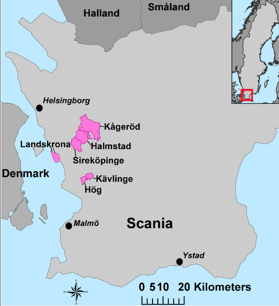

```{r setup, include=FALSE}
knitr::opts_chunk$set(echo = FALSE, fig.height = 4)
##requireNamespace("eha")
suppressWarnings(library(kableExtra))
library(eha)
g <- function(x) (log(x+1))^3 * 365 / (log(366))^3
##ginv <- function(x) 1 - exp(x * ((log(366)^(1/3)) / 365))
ginv <- function(y) exp((y / 365)^(1/3) * log(366)) - 1
##g0 <- function(x) g(x) * 365 / g(365)
dg <- function(x) 3 * (log(1 + x))^2 / (1 + x) * 365 / (log(366))^3
```

# Introduction

Jean Bourgeois-Pichat saw the first year of life not only as the period when mortality is highest, but also the period when improvements should be possible 
[@bp51a; @bp51b; @bp52]. He argued that infant deaths should be divided into two categories, endogenous and exogenous deaths. Endogenous deaths are, by definition, due to inherited factors, or acquired during gestation or delivery. They typically occur at the initial period of life, though sometimes much later and include congenital debility, prematurity, malformations, and disease in early life. Exogenous infant mortality, which Bourgeois-Pichat regards as accidental, are deaths for which the society must hold itself responsible and to reduce endogenous mortality, medical intervention is essential [@bp52]. Since it is, based on causes of deaths, difficult to distinguish between endogenous and exogenous factors, either because they are inaccurate or difficult to make due to the diseases themselves, or the information do not exist, Bourgeois-Pichat offered a solution to the problem.

Bourgeois-Pichat’s biometric model to differentiate between endogenous and exogenous mortality is based on an idea of a universal law governing the
distribution of deaths in the first year of life [@bp52]. He assumes that all deaths taking place in the last eleven months of the first year are exogenous. He argues that, although there are also some endogenous mortalities during this period, they do not affect the development of mortality much. Supported by examples from mid-twentieth century Western and Southern Europe, the US and Canada, New Zeeland, and other countries, Bourgeois-Pichat argued that the cumulative infant deaths after the first month follows a linear development given a log-cube transformation of age [@bp52]. Mortality in the first month of life is then divided into an endogenous and an exogenous assuming that the same linearity also exists in this period. It leads to the conclusion that exogenous deaths in the first 28 days of life represent 22.8 percent of the deaths from the 29th to the 365th day [@bp52; @rp72], or 18.6 percent of the
total number of exogenous infant deaths.

Bourgeois-Pichat also found deviations from the linear death pattern after the first month, the curve for Sardinia in 1948 bend strongly upward after four months [@bp52, Figure 12]. @knoki77 give ample examples of upward bending curves and argue that they are due to increasing mortality after stopping breast feeding. In Quebec 1944--1947, the curve bends down quite strongly after the sixth month [@bp52, Figure 8]. A downward bend is also what has been found using historical Swedish parish data [@tb99, Figure 6b; @tbcl99, Figures 6 and 7; @lyn98, Figures 1 and 2; @jslgt81, Figure 6d], though less pronounced than in Quebec. The curve for Sweden 1910--1946 show, however, no such downward bend but a straight line [@bp51b, Figure 9; @bp52].

Bourgeois-Pichat's biometric method has also been used to identify problems with data recording [@wea77; @weasr81]. While a high level of endogenous mortality cannot be used as a criterion for high data quality, the opposite holds true. A very low level of endogenous mortality indeed indicates data problems, just like large deviations from the normal sex ratio at birth do. These two criteria are, in fact, often used in historical studies to evaluate data quality [@bcl04]. They become even more precise if they are applied to different social strata, since under-recording of early deaths often have a social gradient, possibly due to the costs involved in a burial [@tb99; @tbcl99].

We suggest a variation of the Bourgeois-Pichat biometric analysis of infant mortality. Instead of assuming that the cumulative mortality in the last eleven months of infancy follows a uniform distribution, given a log-cube transformation of age, we assume an exponential distribution. The difference is that while the denominator is constant in the Bourgeois-Pichat model, equal to the number of births, in our model, the denominator is the current population at risk. This assumption is more satisfactory from a theoretical point of view, since it models the conditional probability of dying. The growth in birth weight also follows this distribution [@bp51a; @bp51b]. In addition, the model fit is slightly better for our model, especially in cases with high level of infant mortality, common in pre-modern societies. The advantage is that not only is our assumption more attractive from a theoretical point of view, and therefore easier to interpret, but also that it is makes it easier to estimate exogenous and endogenous infant mortality with standard survival analysis programs. We give examples of the two methods using data for 19th and 20th century norhern Sweden, where both mehods fit very well. In addition, we give examples from 18th century Sweden, where the curve is concave during the last eleven month of infancy, despite high levels of mortality in the first month of life.

# The Bourgeois-Pichat procedure

Central in the procedure suggested by @bp51a is *the log-cube transform*,
see Equation \@ref(eq:logcube).

\begin{equation} (\#eq:logcube)
g(t) = C \log^3(t + 1), \; 0 \le t \le 365,
\end{equation}
where $t$ is age measured in days and $C$ is a normalizing constant,
\begin{equation*}
C = \frac{365}{\log^3(365 + 1)}.
\end{equation*}

```{r logcube, fig.cap = "The log-cube transform of time in days versus the identity transform (dashed). Note that g(365) = 365.", fig.scap = "The log-cube transform", fig.height = 7}
x <- seq(0, 365, length = 366)
plot(x, g(x), type = "l", xlab = "Days", ylab = "g(Days)", 
     col = "blue", axes = FALSE)
att <- c(0, 28, 183, 365)
axis(1, at = att, labels = att)
axis(2, las = 1, at = g(att), labels = c("0", "g(28)", "g(183)", "365"))
box()
lines(c(0, 365), c(0, 365), lty = 2)
abline(v = c(0, 365), h = c(0, 365))
abline(v = 28, h = g(28), col = "darkgreen", lty = 3)
```


The constant $C$ is chosen so that $g(365) = 365$, see Figure \@ref(fig:logcube).
Note that $C$ is *not* part of the original definition of the log-cube transform,
but provided here only to make graphical comparisons easier to interpret. 
It makes no difference otherwise.

Assume that a cohort of infants is followed over time from birth to age one. There are no drop-outs 
(no right censoring except at age 365 days). The exact age in days at each observed death is noted and transformed by $g$, 
and due to imperfect time measuring there are often tied death ages. As an illustrative example, 
we use a data set from Västerbotten in northern Sweden, covering $221\,773$ births with $17\,675$ infant deaths over the years 1861--1950, see 
Figure \@ref(fig:vbmap).

```{r vbmap, fig.cap="Västerbotten.", out.width="6in"}

```


```{r readdata}
infant <- readRDS("Rdata/infant.rds")
infant$month <- months(infant$birthdate)
infant$period <- cut(infant$birthdate, 
                   breaks = as.Date(c("1860-12-31", "1890-12-31", 
                                      "1920-12-31", "1951-01-01")),
                   labels = c("1861-1890", "1891-1920", "1921-1950"))
infant <- infant[, c("birthdate", "sex", "enter", "exit", "event", "period", "month")]
ginfant <- infant
ginfant$enter <- g(infant$enter)
ginfant$exit <- g(infant$exit)
```
For the first and last 30 years in this data set, we have the results shown in Figure \@ref(fig:first).

```{r first, fig.cap = "The periods 1861--1890 and 1921--1950 in Västerbotten, Bourgeois-Pichat method."}
source("R/drawBP.R")
##infant <- infant[infant$month %in% c("juni", "juli", "augusti"), ]
##ginfant <- ginfant[ginfant$month %in% c("juni", "juli",  "augusti"), ]
oldpar <- par(mfrow = c(1,2))
##
r1 <- with(ginfant[ginfant$period == "1861-1890", ], eha::Surv(enter, exit, event))
g1 <- infant[infant$period == "1861-1890", ]
r1 <- eha::risksets(r1, members = FALSE)
drawBP(r1, main = "1861-1890", ylim = c(0, 0.1))
##
##r2 <- with(ginfant[ginfant$period == "1891-1920", ], eha::Surv(enter, exit, event))
##r2 <- eha::risksets(r2, members = FALSE)
##drawBP(r2, main = "1891-1920", ylim = c(0, 0.1))
##
g3 <- infant[infant$period == "1921-1950", ]
r3 <- with(ginfant[ginfant$period == "1921-1950", ], eha::Surv(enter, exit, event))
r3 <- eha::risksets(r3, members = FALSE)
drawBP(r3, main = "1921-1950", ylim = c(0, 0.1))
par(oldpar)
```

The cumulative numbers of deaths, divided by *the number of births*, are plotted against the
corresponding death ages on the $g$ time scale, and as is seen, the fit to linearity
after 28 days (68 on the $g$ scale) is excellent for both time periods.

# The hazard-based procedure

Instead of using the total number of births throughout in the denominator as in  the
Bourgeois-Pichat procedure, we suggest 
using the present risk-set size, that is, the the total number of infants still alive 
immediately prior to the death age under investigation. Given proper data, it is easily achieved.
For instance, by using
the function `risksets` in the **R** [@cran] package `eha` [@eha; @ehar2] we get Table \@ref(tab:risksets).

```{r risksets, echo = FALSE, results = 'asis'}
source("R/tbl.R")
lt1 <- with(r1, cbind(ginv(risktimes), round(risktimes, 1), size, n.events))
lt1 <- data.frame(lt1)
names(lt1) <- c("Day", "g(Day)", "Population", "Deaths")
tbl(lt1[c(1:5, 360:364), ], caption = "Life table for infants in Västerbotten, 1861-1890.")
```

It starts with `r as.integer(lt1[1, 3])` live births, of which `r lt1[1, 4]` dies on the day of birth, 
on average at the age of six hours (a quarter of a day), and so on.

The hazard-based plot corresponding to Figure \@ref(fig:first) is shown in Figure \@ref(fig:second).

```{r second, fig.cap = "The periods 1861--1890 and 1921--1950 in Västerbotten, hazards method."}
source("R/drawBB2.R")
oldpar <- par(mfrow = c(1,2))
##
##r1 <- with(ginfant[ginfant$period == "1861-1890", ], eha::Surv(enter, exit, event))
##r1 <- eha::risksets(r1, members = FALSE)
drawBB2(g1, main = "1861-1890", ylim = c(0, 0.11))
##
##r2 <- with(ginfant[ginfant$period == "1891-1920", ], eha::Surv(enter, exit, event))
##r2 <- eha::risksets(r2, members = FALSE)
##drawBP(r2, main = "1891-1920", ylim = c(0, 0.1))
##
##r3 <- with(ginfant[ginfant$period == "1921-1950", ], eha::Surv(enter, exit, event))
##r3 <- eha::risksets(r3, members = FALSE)
drawBB2(g3, main = "1921-1950", ylim = c(0, 0.11))
par(oldpar)
```

Both methods show an excellent fit to linearity for this data set. But in order to get
a close comparison between the Bourgeois-Pichat and the hazards method, we show the hazards
method in the style of Figure \@ref(fig:first), see Figure \@ref(fig:third).

```{r third, fig.cap = "The hazards method plotted in the Bourgeous-Pichat way, Västerbotten 1861--1890."}
oldpar <- par(mfrow = c(1, 2))
drawBB2(g1, main = "Type hazards plot", ylim = c(0, 0.12))
source("R/drawBB.R")
drawBB(r1, main = "Type Bourgeois-Pichat plot", ylim = c(0, 0.12))
par(oldpar)
```

The left hand panel is clearly more informative, we see both the exogenous and the endogenous
cumulative plots. The dashed blue line in the left hand panel is the exogenous cumulative hazard function,
while it in the right hand panel is the same function, but shifted upwards 0.027 units.
It is a consequence of the "paper, pencil and ruler" method used by @bp51a, and it can be
argued that it gives a visual perception of goodness-of-fit lacking in the left hand panel. 
But that is not relevant, because the same perception of goodness-of fit is achieved by
looking at the estimated endogenous cumulative hazard function: It should be a horizontal straight 
line in the post-neonatal age period.

So in the following graphs, we stick to the hazards plot type.

# Theoretical considerations

We note that the Bourgeois-Pichat method requires that no right censorings (infants lost 
to follow-up before one year of age) are present, and no left truncations (infants under observation 
only from an age later than birth). The hazards approach, on the other hand, allows
left truncation and right censoring. Often, though,
this not very important, since new-born babies tend to be geographically stationary
for their first year of life.

## Post-neonatal mortality

 We start with the *postneonatal* period, since that is the period where Bourgeois-Pichat claims that the *cumulative distribution function* (CDF) is *Uniform*, and we suggest that the CDF is *exponential*, that is, the *cumulative hazard function* is "uniform" (linear).

In order to investigate this, the data set from above is *left truncated* at age 28 days (at 68 on the "g" scale), that is, we are considering the *conditional* survival distribution, given survival to age 28.

```{r postneo, fig.cap = "Exponential fits to postneonatal data, Västerbotten."}
oldpar <- par(mfrow = c(1, 2), cex = 0.7)
post <- age.window(ginfant, c(g(28), g(365)))
p1 <- post[post$period == "1861-1890", ]
p3 <- post[post$period == "1921-1950", ]
fit1 <- coxreg(Surv(exit - enter, event) ~ 1, data = p1)
haz1 <- hazards(fit1)
x <- c(0, haz1[[1]][, 1])
y <- c(0, cumsum(haz1[[1]][, 2]))
##       
wfit1 <- phreg(Surv(exit - enter, event) ~ 1, data = p1, shape = 1)
##check.dist(fit1, wfit1, main = "1861-1890", printLegend = FALSE)
plot(x, y, main = "1861-1890", xlab = "Day", col = "blue",
     ylab = "Cumulative hazards", axes = FALSE, type = "s")
axis(2, las = 1)
axis(1, at = c(0, g(365) - g(28)), labels = c(28, 365))
abline(h = 0)
box()
whaz1 <- hazards(wfit1)
with(whaz1, lines(x, y, lty = 2, col = "red"))
legend("topleft", legend = c("Non-parametric", "Exponential"), lty = 1:2, 
       col = c("blue", "red"), cex = 1)
##
fit3 <- coxreg(Surv(exit - enter, event) ~ 1, data = p3)
haz3 <- hazards(fit3)
x <- c(0, haz3[[1]][, 1])
y <- c(0, cumsum(haz3[[1]][, 2]))
wfit3 <- phreg(Surv(exit - enter, event) ~ 1, data = p3, shape = 1)
whaz <- hazards(wfit3)
plot(x, y, main = "1921-1950", xlab = "Day", col = "blue", 
     ylab = "Cumulativa hazards", axes = FALSE, type = "s")
axis(2, las = 1)
axis(1, at = c(0, g(365) - g(28)), labels = c(28, 365))
box()
abline(h = 0)
with(whaz, lines(x, y, lty = 2, col = "red"))
legend("topleft", legend = c("Non-parametric", "Exponential"), lty = 1:2, 
       col = c("blue", "red"), cex = 1)
par(oldpar)
```

The *Exponential* fit is excellent, with a slight edge for the early period data, 
where post-neonatal mortality is high. 

The fit of the *Uniform* distribution is already shown in Figure \@ref(fig:first).
Also a very good fits in the post-neonatal period.
<!--
```{r postneoBB, fig.cap = "Uniform fits to postneonatal data, Västerbotten.", eval = FALSE}
oldpar <- par(mfrow = c(1, 2), cex = 0.7)
##
rs1 <- risksets(with(p1, Surv(enter, exit, event), members = FALSE))
x <- c(g(28), rs1$risktimes)
y <- c(0, rs1$n.events / rs1$size[1])
y <- cumsum(y)
plot(x, y, type = "s", axes = FALSE, xlab = "Day", ylab = "EDF", 
     main = "1861-1890")
axis(1, at = c(g(28), g(365)), labels = c(28, 365))
axis(2, at = c(0, max(y)), labels = c(0, round(max(y), 2)))
lines(c(g(28), g(365)), c(0, max(y)), lty = 2, col = "red")
box()
##
rs3 <- risksets(with(p3, Surv(enter, exit, event), members = FALSE))
x <- c(g(28), rs3$risktimes)
y <- c(0, rs3$n.events / rs1$size[1])
y <- cumsum(y)
plot(x, y, type = "s", axes = FALSE, xlab = "Day", ylab = "EDF", 
     main = "1921-1950")
axis(1, at = c(g(28), g(365)), labels = c(28, 365))
axis(2, at = c(0, max(y)), labels = c(0, round(max(y), 2)))
lines(c(g(28), g(365)), c(0, max(y)), lty = 2, col = "red")
box()
##
par(oldpar)
```

-->

## Exogeneous mortality 

We now consider the whole infant age span (on the $g$ scale), and compare the uniform and exponential densities, especially of interest is the fraction of deaths that occur in the neonatal phase. @manfred04 argues that a less satisfactory property of the *B-P* model is that this fraction is constant, 
18.56 percent, independent of the overall level of infant mortality $p$. This is not the case for the hazards model, see Table \@ref(tab:exog).
As the total mortality increases, the fraction exogenous deaths in the neonatal period also increases.
```{r exog}
source("R/tbl.R")
p <- c(0.005, 0.01, 0.05, 0.1, 0.2)
lambda <- -log(1 - p) / 365
n <- length(p)
exo28 <- numeric(n)
exo365 <- numeric(n)
for (i in 1:n){
    exo28[i] <- pexp(g(28), lambda[i]) * 1000
    exo365[i] <- pexp(g(365), lambda[i]) * 1000
}
utt <- cbind(exo28, exo365, round(100 * (exo28 / exo365), 2))
utt <- round(utt, 3)
colnames(utt) <- c("Neonatal", "Total", "Fraction")
tbl(utt, caption = "Distribution over age periods of exogenous mortality (per 1000).")
```
 
## Endogeneous mortality

In order to calculate the *endogeneous* infant mortality, a simple two-step procedure leads
to the goal.

1.   Estimate the post-neonatal mortality following the exponential route. It reduces to a
simple occurrence/exposure calculation: The total number of post-neonatal deaths $D$ is divided by the
total postneonatal exposure $E$ on the $g$ scale. So
\begin{equation*}
\hat{\lambda} = \frac{D}{E}
\end{equation*}
is the estimated hazard function (constant), and the cumulative hazard function is
\begin{equation*}
\hat{H}(t) = \hat{\lambda} t, \; t > 0
\end{equation*}


2.   On the full infant interval, estimate the total cumulative hazard rate $A(t)$ with the usual 
Nelson-Aalen estimator $\hat{A}(t)$ [@nelson72; @aalen78]. Then, subtract $H(t)$ from 
$\hat{A}(t)$ to get $\hat{E}(t)$.
\begin{equation} (\#eq:endog)
\hat{E}(t) = \hat{A}(t) - \hat{\lambda} t,\; 0 < t \le g(28).
\end{equation}
Note that subtraction and addition of competing risks are okay on the hazards scale, 
but not with probabilities, which is yet another argument in favor of the hazards approach. 

Let us do it with the given data (Table 3), and the full period 1861--1950.

### Step 1: Estimate post-neonatal (exogenous) mortality

\begin{table}

\caption{First and last five rows of data frame.}
\centering
\fontsize{11}{13}\selectfont
\begin{tabular}[t]{llrrrl}
\toprule
\textbf{birthdate} & \textbf{sex} & \textbf{enter} & \textbf{exit} & \textbf{event} & \textbf{period}\\
\midrule
1861-01-01 & girl & 0 & 163 & 1 & 1861-1890\\
1861-01-01 & boy & 0 & 365 & 0 & 1861-1890\\
1861-01-01 & girl & 0 & 365 & 0 & 1861-1890\\
1861-01-01 & boy & 28 & 365 & 0 & 1861-1890\\
1861-01-01 & boy & 0 & 57 & 1 & 1861-1890\\
\addlinespace
1950-12-31 & girl & 0 & 365 & 0 &  1921-1950\\
1950-12-31 & girl & 0 & 365 & 0 & 1921-1950\\
1950-12-31 & boy & 0 & 365 & 0 & 1921-1950\\
1950-12-31 & girl & 0 & 365 & 0 & 1921-1950\\
1950-12-31 & girl & 0 & 309 & 0 & 1921-1950\\
\bottomrule
\end{tabular}
\end{table}

```{r firstlines}
n3 <- NROW(infant)
out <- infant[c(1:5, (n3-4):n3), 1:6]
out[3, 2] <- "girl"
out[4, 3] <- 28
##tbl(out, caption = "First and last five rows of data frame.")
nro <- nrow(infant)
deat <- as.integer(sum(infant$event))
```

```{r retrunc, echo = FALSE}
postneo <- eha::age.window(infant, c(28, 365))
gpostneo <- eha::age.window(ginfant, c(g(28), g(365)))
days <- sum(gpostneo$event)
expo <- with(gpostneo, sum(exit - enter))
rate <- days / expo
```

Post-neonatal mortality is the same as exogenous mortality in the sense that the
hazard functions are the same on the post-neonatal age interval. So the first step
involves data left truncated at age 28 days. The maximum-likelihood estimator of the rate 
in the exponential distribution is simply the number of observed post-neonatal deaths
`r as.integer(days)`, 
divided by the total post-neonatal exposure time `r format(round(expo), scientific = FALSE)` (still on the $g$ scale), 
giving a rate of `r rate`.


The rate is a very small number as a consequence of the very small time unit 
(implying large total exposure time), originally *day*.

So we are done with the simple post-neonatal period.

### Step 2: Estimate total and endogenous mortality

The estimation of the cumulative hazard function for the total neonatal mortality is standard. <!--
easily achieved by calling the function `hazards` in the *eha* package, see also Figure \@ref(fig:hazards).
-->
```{r hazards, eval = TRUE}
neo <- age.window(ginfant, c(0, g(28)))
par(las = 1)
fit <- coxreg(Surv(enter, exit, event) ~ 1, data = neo)
hneo <- hazards(fit, cum = TRUE)
x <- c(0, hneo[[1]][, 1])
y <- c(0, 1000 * cumsum(hneo[[1]][, 2]))
##plot(x, y, type = "s", xlab = "Day", ylab = "by 1000", axes = FALSE)
##axis(2, las = 1)
##axis(1, at = c(g(0), g(7), g(14), g(21), g(28)), labels = c(0, 7, 14, 21, 28))
##axis(2)
##box()
##lines(x, 1000 * rate * x, col = "blue", lty = 2)
##abline(h = 0, v = 0)
##text(8, 15, "Total", col = "black")
##text(8, 5, "Exogenous", col = "blue")
```

Next, take the difference between "Total" and "Exogenous", as in Equation \@ref(eq:endog) to get "Endogenous",
the result is shown in Figure \@ref(fig:enof).

```{r enof, fig.cap = "Cumulative hazard functions for neonatal mortality, Västerbotten 1861--1950.", fig.width = 7}
yen <- y - 1000 * rate * x ##"Endo"
par(las = 1)
plot(x, yen, type = "s", col = "red", xlab = "Day", ylab = "by 1000", ylim = c(0, 36), axes = FALSE)
axis(2, las = 1)
axis(1, at = c(g(0), g(7), g(14), g(21), g(28)), labels = c(0, 7, 14, 21, 28))
box()
abline(h = 0, v = 0)
lines(x, 1000 * rate * x, col = "blue", lty = 3)
lines(x, y, lty = 1, type = "s")
text(8, 20, "Total", cex = 0.8)
text(15, 14, "Endogenous", col = "red")
text(8, 5, "Exogenous", col = "blue", cex = 0.8)
n <- length(yen)
axis(4, at = c(0, 1000 * rate * x[n], yen[n], y[n]), las = 1, cex.axis = 0.7)
```

## The assumptions about exogenous mortality

*Exogenous* causes of death are due to social, cultural, economic, and environmental 
factors, and also accidents. An argument for the constant hazards and the uniform approaches to
exogenous infant mortality is that, after compensating for age via the log-cube transformation, 
these factors are random and evenly spread in time, like *white noise*. However,  this disregards 
seasonal variations in weather, and following that the spread of infectious diseases.

To illustrate this, data will be split in two ways, first by "birth month" (cohort data) and second by
"calendar month" (period data).

### Cohorts by birth month

```{r datain}
library(eha)
nu <- Sys.setlocale("LC_ALL", "en_US.UTF-8")
g <- function(x) (log(x+1))^3 * 365 / (log(366))^3
infa <- readRDS("Rdata/infant.rds")[, c("id", "sex", "birthdate", "enter", "exit", "event")]
infa$exit <- infa$exit / 365 ## NOTE!!
infa$bmonth <- months(infa$birthdate, abbreviate=TRUE)
infa$bmonth <- factor(infa$bmonth, levels = month.abb)
winter <- with(infa, bmonth %in% c("Dec", "Jan", "Feb"))
spring <- with(infa, bmonth %in% c("Mar", "Apr", "May"))
summer <- with(infa, bmonth %in% c("Jun", "Jul", "Aug"))
fall <- with(infa, bmonth %in% c("Sep", "Oct", "Nov"))
infa$bseason <- ""
infa$bseason[winter] <- "winter"
infa$bseason[summer] <- "summer"
infa$bseason[fall] <- "fall"
infa$bseason[spring] <- "spring"
infa$bseason <- factor(infa$bseason, levels = c("spring", "summer", "fall", "winter"))
infa$bdate <- toTime(infa$birthdate)
##infa$bdate <- (infa$bdate - floor(infa$bdate)) * 365
cuts <- seq(0, 1, by = 1 / 12)
comm <- data.frame(month = rep(month.abb, 100))
dat <- make.communal(infa, comm, start = 1861, period = 1 / 12,
                     surv = c("enter", "exit", "event", "bdate"))
dat$month <- factor(dat$month, levels = month.abb)
winter <- with(dat, month %in% c("Dec", "Jan", "Feb"))
spring <- with(dat, month %in% c("Mar", "Apr", "May"))
summer <- with(dat, month %in% c("Jun", "Jul", "Aug"))
fall <- with(dat, month %in% c("Sep", "Oct", "Nov"))
dat$season <- ""
dat$season[winter] <- "winter"
dat$season[spring] <- "spring"
dat$season[summer] <- "summer"
dat$season[fall] <- "fall"
dat$season <- factor(dat$season, levels = c("spring", "summer", "fall", "winter")) 
dat$enter <- 365 * dat$enter # NOTE!
dat$exit <- 365 * dat$exit # NOTE!
```

```{r plotcohort, fig.cap = "By birth month, cohorts, Västerbotten 1861--1950.", fig.height = 8, eval = TRUE}
oldpar <- par(mfrow = c(1, 1))
dato <- dat[dat$birthdate < as.Date("1950-12-31"), ]
fit <- coxreg(Surv(g(enter), g(exit), event) ~ strata(bmonth), data = dato)
cols <- c("blue", "magenta", rep("red", 4), rep("green", 3), "magenta", "blue", "blue")
haz <- hazards(fit)
pd <- numeric(12)
for(i in 1:12){
    haz[[i]] <- rbind(c(0, 0), haz[[i]])
    haz[[i]][, 2] <- cumsum(haz[[i]][, 2])
    pd[i] <- round((1 - exp(-max(haz[[i]][, 2]))) * 100, 1)
}
plot(haz[[1]][, 1], haz[[1]][, 2], col = cols[1], axes = FALSE, 
     type = "l", xlab = "Days", ylab = "Cumulative hazards")
for (i in 2:12){
    lines(haz[[i]][, 1], haz[[i]][, 2], col = cols[i], type = "l", lty = i)
}
legend("topleft", legend = paste(month.abb, pd, sep = ":  "), lty = 1:12, col = cols)
att <- c(0, 28, 183, 365)
axis(1, at = g(att), labels = att)
axis(2, las = 1)
box()
abline(v = g(28), lty = 3)
abline(h = 0)
fita <- coxreg(Surv(g(enter), g(exit), event) ~ 1, data = dato)
haza <- hazards(fita)
lines(c(0, haza[[1]][, 1]), cumsum(c(0, haza[[1]][, 2])), type = "l", lwd = 2, col = "black")
legend(100, 0.08, legend = "All", lty = 1, col = "black", lwd = 2)
par(oldpar)
```

```{r plotcohort2, fig.cap = "By birth season, cohorts.", fig.height = 8, eval = FALSE}
oldpar <- par(mfrow = c(2, 2))
for (seas in levels(dat$bseason)){
    drawBB2(dat[dat$bseason == seas, ], main = seas, printLegend = FALSE)
}
par(oldpar)
```

We see that the post-neonatal part of the total cumulative hazards are more or
less convex (bend upward at the end) for those born in spring (red) or summer (green), while 
the curves are concave for births in the winter (blue). Bad fits to "constant hazard"
and "uniform distribution". However, as the solid black curve shows, the 12-month mixture 
has an excellent fit to a straight line.

Note the two outliers, February and October. Born in February means a tough first month of 
life, but surviving that, the future prospects are great. The opposite holds for those born in October, 
no problems during the neonatal phase, but then comes the tough winter months. 

### Periods by month

```{r plotcohort3, fig.cap = "By month, period data, Västerbotten 1861--1950.", fig.height = 8, eval = TRUE}
oldpar <- par(mfrow = c(1, 1))
dato <- dat[dat$birthdate < as.Date("1950-12-31"), ]
fit <- coxreg(Surv(g(enter), g(exit), event) ~ strata(month), data = dato)
cols <- c("blue", "magenta", rep("red", 4), rep("green", 3), "magenta", "blue", "blue")
haz <- hazards(fit)
pd <- numeric(12)
for(i in 1:12){
    haz[[i]] <- rbind(c(0, 0), haz[[i]])
    haz[[i]][, 2] <- cumsum(haz[[i]][, 2])
    pd[i] <- round((1 - exp(-max(haz[[i]][, 2]))) * 100, 1)
}
plot(haz[[1]][, 1], haz[[1]][, 2], col = cols[1], axes = FALSE, 
     type = "l", xlab = "Days", ylab = "Cumulative hazards")
for (i in 2:12){
    lines(haz[[i]][, 1], haz[[i]][, 2], col = cols[i], type = "l", lty = i)
}
legend("topleft", legend = paste(month.abb, pd, sep = ":  "), lty = 1:12, col = cols)
att <- c(0, 28, 183, 365)
axis(1, at = g(att), labels = att)
axis(2, las = 1)
box()
abline(v = g(28), lty = 3)
abline(h = 0)
fita <- coxreg(Surv(g(enter), g(exit), event) ~ 1, data = dato)
haza <- hazards(fita)
lines(c(0, haza[[1]][, 1]), cumsum(c(0, haza[[1]][, 2])), type = "l", lwd = 2, col = "black")
legend(100, 0.08, legend = "All", lty = 1, col = "black", lwd = 2)
par(oldpar)
```


```{r plotperiod, fig.cap = "By calendar month, period data, Västerbotten 1861--1950.", fig.height = 9, eval = FALSE}
oldpar <- par(mfrow = c(4, 3))
for (mon in levels(dat$bmonth)){
    drawBB2(dat[dat$month == mon, ], main = mon, printLegend = FALSE)
}
par(oldpar)
```

```{r plotperiod2, fig.cap = "By calendar season, periods.", fig.height = 8, eval = FALSE}
oldpar <- par(mfrow = c(2, 2))
for (seas in levels(dat$season)){
    drawBB2(dat[dat$season == seas, ], main = seas, printLegend = FALSE)
}
par(oldpar)
```
The periods are of course more homogeneous regarding weather and external threats,
and it shows off in that for all months the suggested models fit reasonably well, 
although on different levels, here shown by the "constant hazards model" for exogenous mortality.

### Conclusion

The assumptions about constant hazard and uniform distribution of exogenous mortality 
are only applicable on the population level, it can never hold for an individual. It can 
be thought of as an average over birth cohorts, where it is important to have birth dates 
spread evenly within calendar years.

## Tabular data

Often the Bourgeois-Pichat method is applied to tabular data. The most extreme case is
that the only available data are number of births $B$, number of neonatal deaths $D_1$, and total 
number of deaths $D$. The Bourgeois-Pichat line fitting is very simple to do in this case, but 
how about the hazards approach? 

It turns out that it is easy to find given the data at hand followíng the procedure given in 
Section 4.3: The probability of dying in the post-neonatal period, given survival of the neonatal
period is estimated by $\hat{p} = (D-D_1) / (B - D_1)$, and the length of the post-neonatal time span 
is $T = g(365) - g(28) \approx 297$ "g-units". The estimate of the rate $\lambda$ in the post-neonatal period
is then given by

\begin{equation*}
\hat{\lambda} = -\frac{log(1 - \hat{p})}{T}.
\end{equation*}

And so on.

## Biometric analysis on the natural time scale

Given that the exogenous mortality follows an Exponential distribution on the log-cube scale, 
it follows that the cumulative hazards function on the natural time scale is

\begin{equation*}
H(t; \lambda) = \lambda \log^3(t + 1), \; t > 0.
\end{equation*}

Note the duality: $\text{log-cube transform} \Longleftrightarrow  \text{cumulative hazards function}$!

It follows that the hazard function $h$ is given by

\begin{equation*}
h(t; \lambda) = \lambda \frac{3 \log^2(t + 1)}{t + 1}, \; t > 0,
\end{equation*}

see Figure \@ref(fig:normal).

```{r normal, fig.cap = "Exogeneos hazard function on the normal time scale."}
x <- 0:365
y <- dg(x)
plot(x, y, type = "l", xlab = "Day", ylab = "Hazards",
     axes = FALSE, col = "blue", lwd = 2)
axis(1, at = c(0, 28, 183, 365))
axis(2, las = 1, at = 0)
box()
abline(h = 0, v = 0)
abline(v = 28, lty = 2, col = "darkgreen")
```

We may be relatively confident that the shape is OK in the post-neonatal period, where data are available, but the shape during the neonatal period is a pure guess.
Examining data with *known* causes of death might be enlightening.

We repeat the hazards method for Västerbotten 1961--1890 on both the log-cube 
and the natural time scales for comparison, see Figure \@ref(fig:natlogcube2).

```{r natlogcube2, fig.cap = "Västerbotten 1861-1890, log-cube and natural time scales."}
par(mfrow = c(1, 2), las = 1, lwd = 2)
rate <- drawBB2(g1, main = "Log-cube", ylim = c(0, 0.11))
fit <- coxreg(Surv(enter, exit, event) ~ 1, data = g1)
##plot(fit, main = "Natural", lwd = 3)
hz <- hazards(fit)
x <- c(0, hz[[1]][, 1])
y1 <- c(0, cumsum(hz[[1]][, 2]))
plot(x, y1, type = "l", axes = FALSE, xlab = "Days", main = "Natural",
     ylab = "Cumulative hazards", ylim = c(0, 0.11))
axis(1, at = c(0, 28, 91, 183, 274, 365))
axis(2, at = c(0, 0.015, 0.027, 0.042, 0.080, 0.108))
box()

abline(v = 28, lty = 2, lwd = 1)
abline(h = 0, lwd = 1)
y <- g(x) * rate
lines(x, y, lty = 2, col = "blue")
## And the Endogenous:
y2 <- y1 - y
lines(x, y2, lty = 4, col = "red")
```

The picture on the natural time scale is of course what we prefer, so why did Bourgeois-Pichat use the log-cube time transform instead of the log-cube cumulative hazards function? The answer is of course that he had no access to a computer back in the fifties, and his way of compensating for that was in fact very clever. Similar pencil-and-ruler techniques have earlier been used, for instance in *Weibull probability plotting* [@ww51].

# Biometric analysis in practice

The original procedure of Bourgeos-Pichat is compared to the hazard based procedure for some typical
cases from the real world.

```{r plotfun}
pf <- function(x){
   ## x is a dataframe NOT on g scale
    y <- x
    y$enter <- g(y$enter)
    y$exit <- g(y$exit)
   rs <- with(y, eha::risksets(Surv(enter, exit, event), members = FALSE))
   oldpar <- par(mfrow = c(1, 2))
   drawBB2(x, main = "Hazards method")
   drawBP(rs, main = "B-P method")
##
par(oldpar)
}
```


## Västerbotten 

Thee data set from Västerbotten 1861--1950, kept by CEDAR, Umeå University [@u22003], 
shows almost perfect fits to both the hazards model
and the original biometric model [@bp51a; @bp51b] in all the three subperiods, see
the results in the following three subsections.

### The period 1921--1950

```{r lowume}
##source("R/drawBP.R")
##source("R/drawBB.R")
ume <- infant##[infant$fodfrs %in% c(82750, 82780), ]
ume <- ume[ume$birthdate > "1920-12-31", ]
crudimr <- with(ume, sum(event) / sum(exit - enter)) * 365
crudprob <- round((1 - exp(-crudimr)) * 1000)
```

The crude IMR in Västerbotten 1921--1950 was around `r crudprob` per thousand, a rather 
low figure in context. Let us perform the biometric analysis with these data, see 
Figure \@ref(fig:lowumee).

```{r lowumee, fig.cap = "Västerbotten 1921--1950."}
##source("R/compare.R")
##xx <- bio(ume, timescale = "day", graph = TRUE)
##post <- age.window(ume, c(g(28), g(365)))
##rs.post <- risksets()
ume <- infant[infant$birthdate > "1920-12-31", ]
pf(ume)
```

There is a good hazards model fit, and we see that the endogenous mortality clearly dominates 
the early days of neonatal mortality, and almost vanishes towards the start of the post-neonatal period.

The B-P model fit is slightly worse, but not much to bother about.

### The period 1890--1920

```{r medume}
source("R/biometric.R")
ume <- infant##[infant$fodfrs %in% c(82750, 82780), ]
ume <- ume[(ume$birthdate > "1890-12-31") & (ume$birthdate <= "1920-12-31"), ]
crudimr <- with(ume, sum(event) / sum(exit - enter)) * 365
crudprob <- round((1 - exp(-crudimr)) * 1000)
```

The crude IMR in Västerbotten 1891--1920 was around `r crudprob` per thousand, clearly higher than 
the later time period. Let us perform the biometric analysis with these data, see 
Figure \@ref(fig:bioume9120).

```{r bioume9120, fig.cap = "Västerbotten 1891--1920."}
##source("R/compare.R")
##xx <- bio(ume, timescale = "day", graph = TRUE)
##post <- age.window(ume, c(g(28), g(365)))
##rs.post <- risksets()
##ume$exit <- g(ume$exit)
##ume$enter <- g(ume$enter)
pf(ume)
```

The dominance of endogenous mortality in early life is still clear. The hazards fit is still slightly better.

### The period 1861--1890

```{r highume}
source("R/biometric.R")
ume <- infant##[infant$fodfrs %in% c(82750, 82780), ]
ume <- ume[(ume$birthdate <= "1890-12-31"), ]
crudimr <- with(ume, sum(event) / sum(exit - enter)) * 365
crudprob <- round((1 - exp(-crudimr)) * 1000)
```

The crude IMR in Västerbotten 1861--1890 was around `r crudprob` per thousand, highest of the three
time periods.
The biometric analysis is shown in 
Figure \@ref(fig:bioume6190).

```{r bioume6190, fig.cap = "Västerbotten 1861--1890."}
##source("R/compare.R")
##xx <- bio(ume, timescale = "day", graph = TRUE)
##post <- age.window(ume, c(g(28), g(365)))
##rs.post <- risksets()
##ume$exit <- g(ume$exit)
##ume$enter <- g(ume$enter)
pf(ume)
```

The conclusion here is almost the same as  for the later time periods, good model
fit and endogenous dominance in the very early days of life. 
However, the B-P method seems to have a slight upper hand regarding model fit.


## Skåne 1710--1800.

Skåne is the southernmost province of Sweden, see the map in Figure \@ref(fig:scaniamap).

```{r scaniamap, fig.cap = "Skåne.", out.width="6in"}

```

This dataset covers five parishes and 7461 births with 1654 infant deaths in Skåne 1710--1800 [@sedd].
It is an interesting case because it appears as if the data quality is low since 
the linearity during the post-neonatal period is gone. Rather, there is a "hockey-stick" pattern, 
also seen in other old data sets. See Figure \@ref(fig:scahigh).

However, this data set is known to be of very high quality [@tbcl99]. Sex ratio at birth 
is as expected and the neonatal mortality is high for all social groups. We are therefore inclined to 
think that the biometric model as it is described here simply is inappropriate during the eighteenth century.
Specifically, the log-cube transformation, which fits well with 19th century data, seems
to be completely out of order in the eighteenth century, maybe due to the high infant mortality,
which in this data set is 222 per thousand. 

```{r scahigh, fig.cap = "Skåne 1710--1800."}
sca1 <- readRDS("Rdata/sca1.rds")
sca1 <- sca1[sca1$BirthDate < "1801-01-01", ]
sca11 <- sca1
sca1$exit <- g(sca1$exit)
sca1$enter <- g(sca1$enter)
rs <- with(sca1, risksets(Surv(enter, exit, event), members = FALSE))
oldpar <- par(mfrow = c(1, 2))
drawBB2(sca11, main = "Hazards method")
drawBP(rs, main = "B-P method")
par(oldpar)
```

Let us look at what happens on the natural time scale and with the Gompertz distribution 
replacing the log-cube time transformation, see Figure \@ref(fig:escu).

```{r escu, fig.cap = "Skåne 1710--1800, natural time scale, Gompertz exogenous distribution."}
#source("R/biometric.R")
#biometric(sca1, graph = TRUE)
par(mfrow = c(1, 1), las = 1, lwd = 2, cex = 0.7)
fit.c <- coxreg(Surv(enter, exit, event) ~ 1, data = sca11)
hc <- hazards(fit.c)
x <- c(0, hc[[1]][, 1])
y <- c(0, cumsum(hc[[1]][, 2]))
post <- age.window(sca11, c(28, 365))
fit.g <- phreg(Surv(enter, exit, event) ~ 1, data = post, dist = "gompertz", param = "rate")
hg <- hazards(fit.g)
plot(x, y, type = "l", xlab = "Day", ylab = "Cumulative hazards", axes = FALSE)
axis(1, at = c(0, 28, 183, 365))
att <-  c(0, 0.041, 0.063, 0.104, 0.216, 0.278)
axis(2, at = att)
abline(h = att, lty = 3, lwd = 1)
abline(h = 0, lwd = 1) 
abline(v = 28, lty = 2, lwd = 1, col = "darkgreen")
abline(v = 0, lwd = 1)
box()
y1 <- Hgompertz(x, shape = exp(-6.4115), rate = -0.007017,  param = "rate")
lines(x, y1, col = "blue", lty = 2)
xp <- x[c(0, 31:320)]
yp <- y - y1
lines(x, yp, col = "red", lty = 4)
```

Quite okay, if not perfect,

## Skellefteå 1821--1838

An example of severe under-registration during the neonatal period, see Figure \@ref(fig:skum).
There is no room for endogenous deaths at all, but otherwise a reasonably good fit with both 
methods in the post-neonatal period..

```{r skum, fig.cap = "Skellefteå 1821--1838."}
library(skum)
births <- obs[obs$starttyp == 2 &
                 obs$foddat < as.Date("1839-01-01") &
                 obs$foddat > as.Date("1820-12-31"), ]
births$event <- births$sluttyp == 2
births$enter <- 365 * births$enter
births$exit <- 365 * births$exit
addup <- births$exit <= 0
births$exit[addup] <- 0.25
infa <- age.window(births, c(0, 365))
##infa$enter <- g(infa$enter)
##infa$exit <- g(infa$exit)
pf(infa)
```

# Conclusion

If anything, the hazards method never performs worse than the B-P method.
But the real strength of the hazards method is that it fits naturally into general 
modern survival analysis with censored and truncated data, and also proportional 
hazards models with covariates. 
<!--
On the other hand, the whole business with the 
biometric analysis and the log-cube transform seems to be highly questionable. 
It works for data in approximately the same time period and similar environment, 
but beyond that, it is not generalizable at all. These methods should be used with 
great care, if at all.
-->
Apparently, it works for many places in the mid-twentieth century, but beyond that, 
it is not generalisable. In fact, also when post-neonatal mortality is following a 
straight line on the log-cube scale, mortality may well deviate during different 
parts of the year. This means that the methods should be used with great care and 
only as a starting point.

# References
